## API CINEMA_USUARIOS

Essa API foi desenvolvida em .NET, trata-se de uma API que simula o sistema de um cinema, onde pode-se cadastrar 
um cinema e as sessões que são associadas ao mesmo. Também podemos cadastrar em cada cinema vários filmes e um 
gerente responsável por aquele cinema 

# OBS: 

Ao baixar o projeto, você deve atualizar a ConnectionString, colocando os dados do banco de dados que você quer 
se conectar. Também devem gerar novas migrations e atualizar o banco de dados com os comandos (respectivamente):

                        dotnet ef migrations add nomeDaMigration
                        dotnet ef database update 

Usaremos o MySql para armazenar nossos dados: 
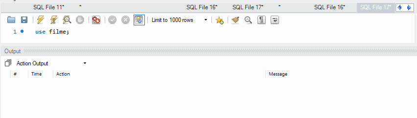
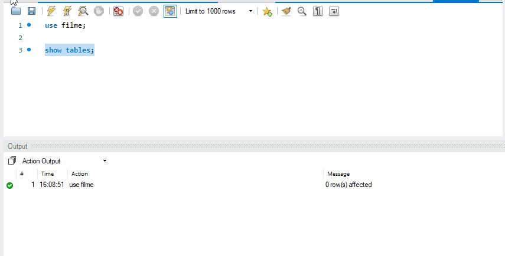

# CINEMA 
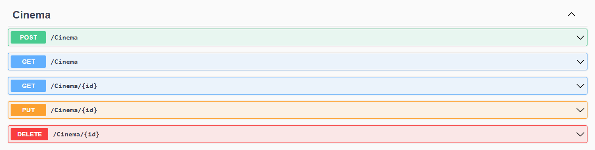

### POST 
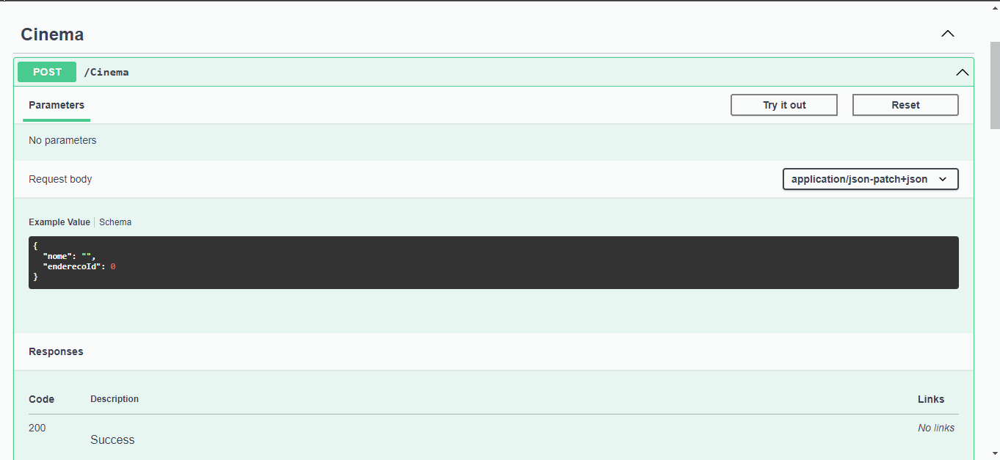
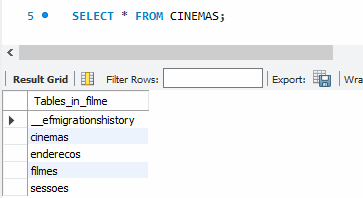 

### GET 
Podemos dar um GET sem passar nenhum parametro, a API nos retornara, todos os cinemas. 
Como tambem, podemos passar o ID do endereco de um dos cinemas, e a API nos retornara 
apenas o cinema com o endereco correspondente. 

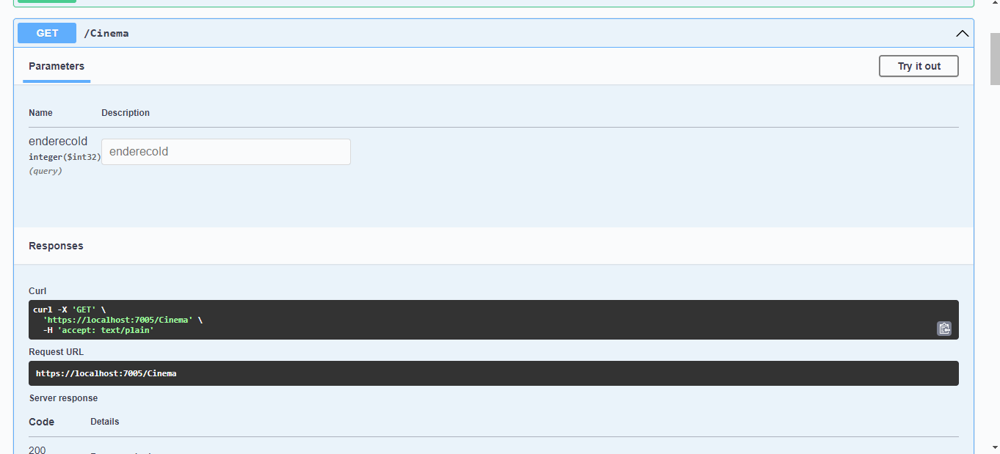

### GET ID  

Permite a busca atraves do ID do cinema 

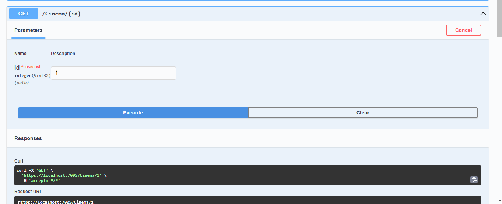

### PUT 

Permite a atualizacao do cinema atraves do seu ID

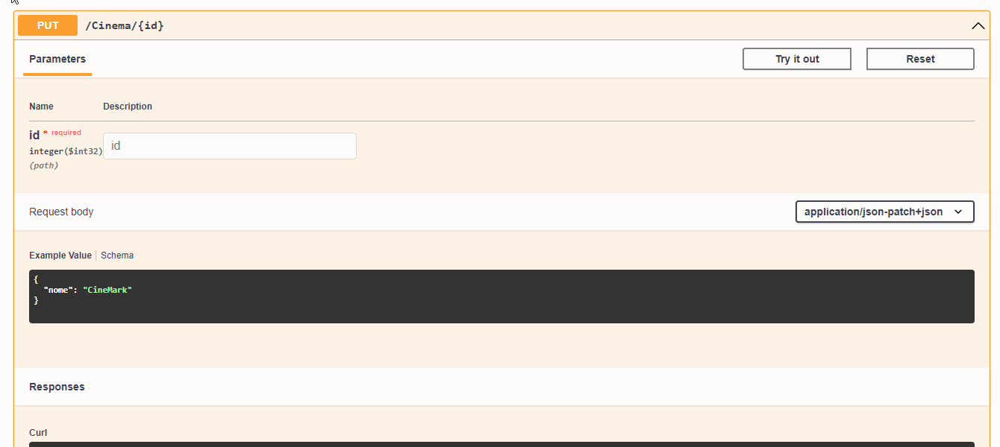

### DELETE 

Permite deletar um cinema atraves do seu id 

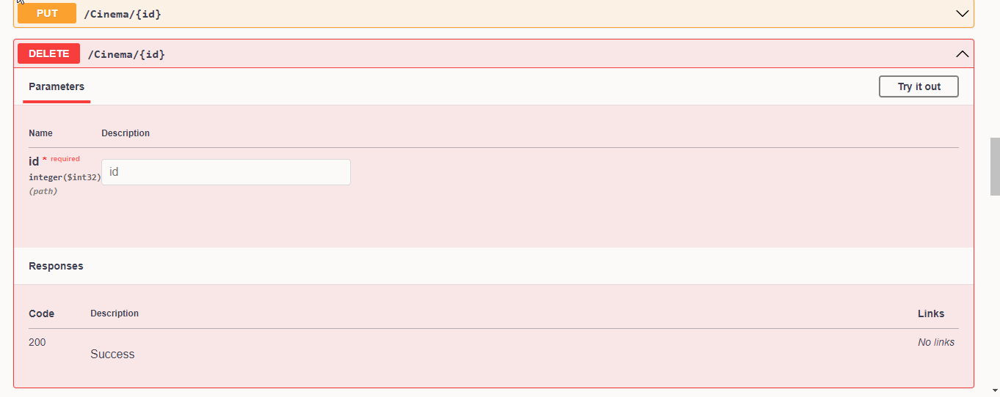

# ENDERECO 

### POST 
Cadastro de um endereco
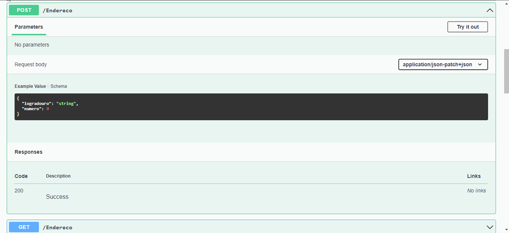

### GET 
Traz todos os enderecos cadastrados 
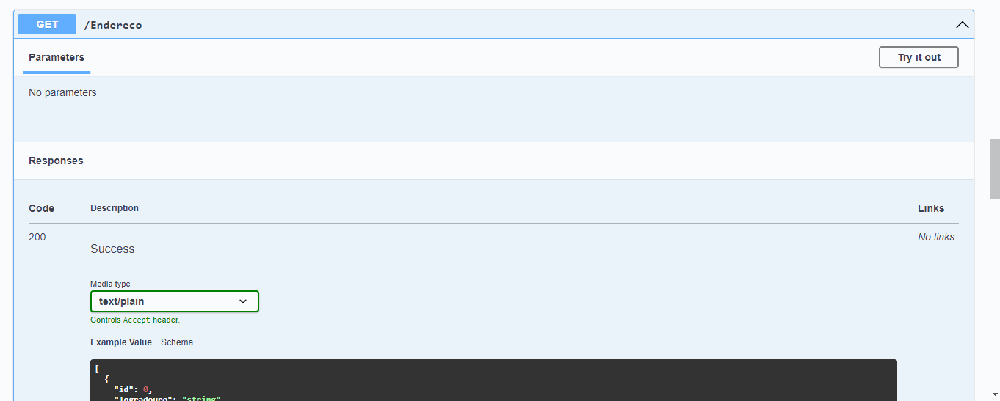

### GET ID
Traz um endereco pelo seu ID 
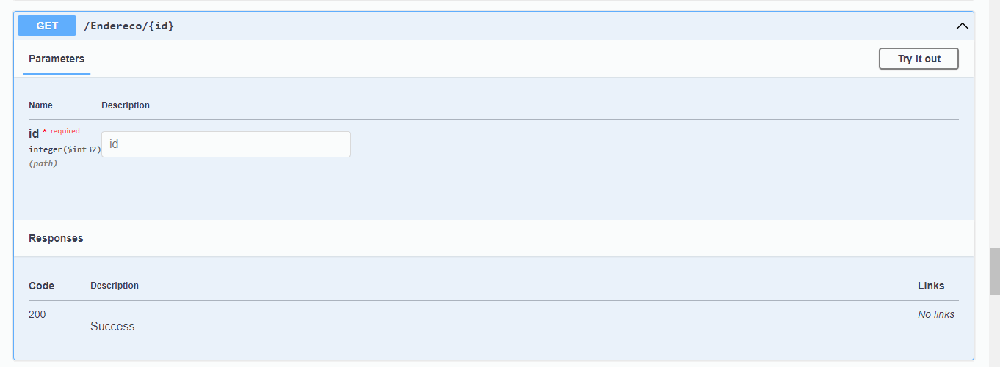

### PUT 
Atualiza endereco pelo ID 
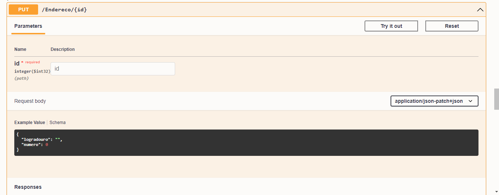

### DELETE 
Deleta um endereco pelo ID 
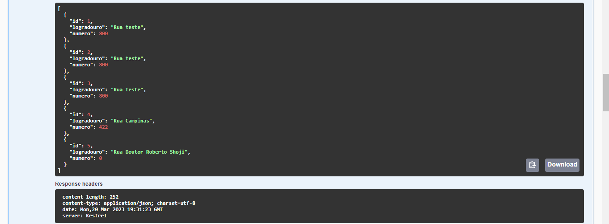

# FILME 

### POST 
Cadastro de um endereco
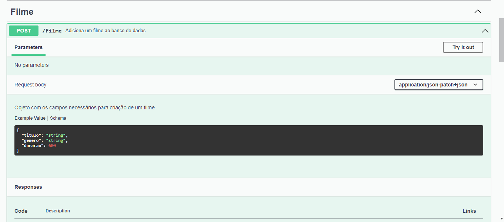

### GET 
Traz todos os enderecos cadastrados (pode-se filtrar atraves de SKIP - itens que voce quer pular 
e TAKE - quantos voce quer exibir)
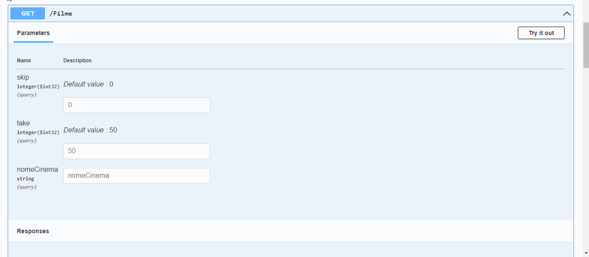

### GET ID
Exibe filme pelo ID 
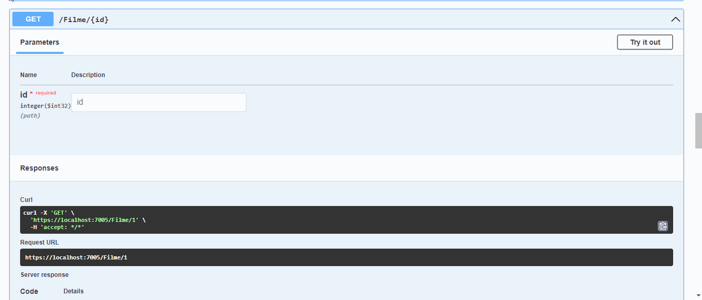

### PUT 
Atualiza endereco pelo ID 
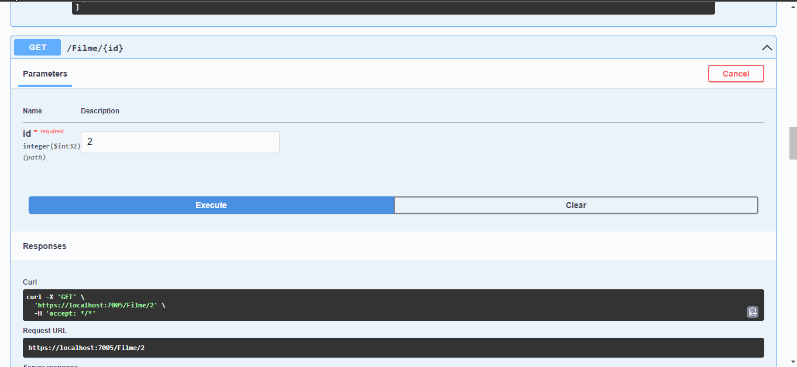

### DELETE 
Deleta filme pelo ID 

# SESSAO 

### POST 
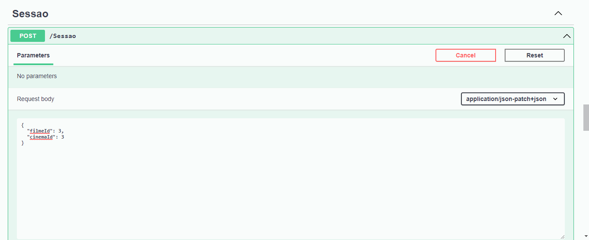

### GET 
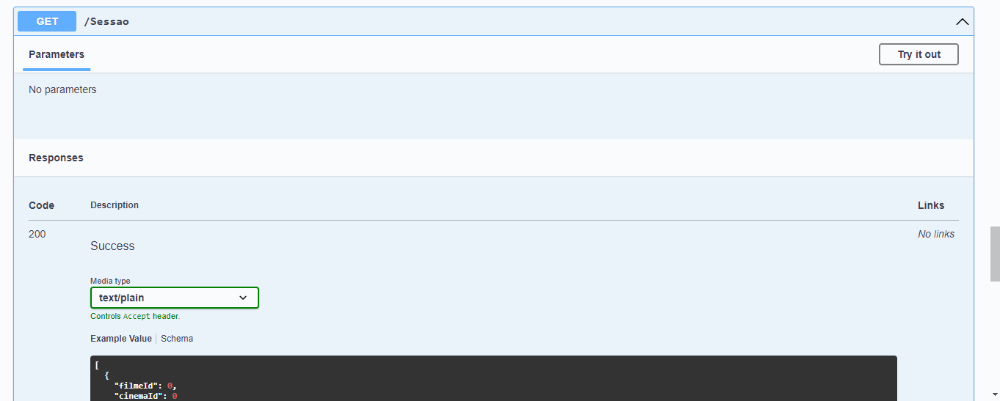

### GET ID
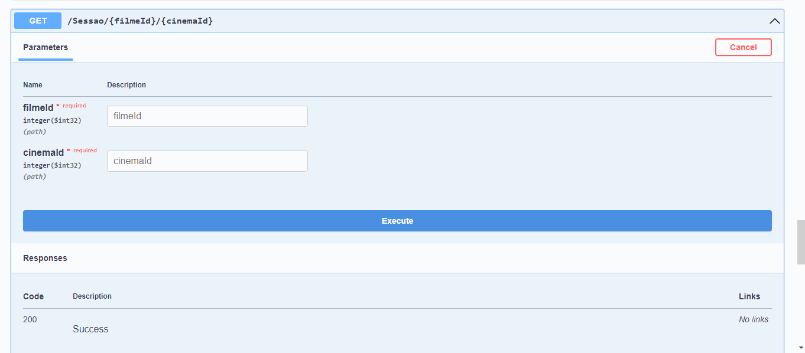

# RELACOES 

### 1:1 
Um cinema so pode ter 1 endereco relacionado a ele e vice versa. 
Uma sessao so tem um filme relacionado a ela. 

### 1:N
Um cinema pode ter varias sessoes.
Um filme pode ser exibido em varios cinemas. 
Um cinema pode ter varios filmes. 

### N:N 
O cinema pode exibir um ou muitos filmes e o filme pode estar sendo exibido em um ou muitos cinemas 

